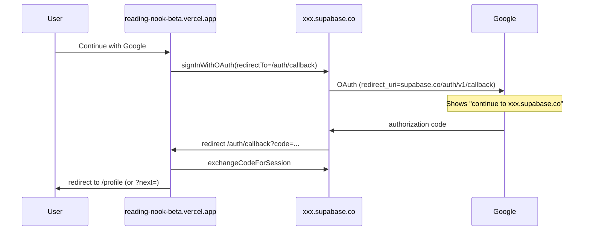

# Google OAuth branding (Reading Nook)

When users tap **Continue with Google**, Google may show:

> Choose an account to continue to **`ilfojdpnalhwakpbegzr.supabase.co`**

That string is **not** controlled by the Next.js app. Google shows the **domain of the OAuth redirect URI**, which for Supabase Auth is always:

```text
https://<project-ref>.supabase.co/auth/v1/callback
```

Changing **Site URL** or app **Redirect URLs** in Supabase fixes where users land **after** sign-in; it does **not** change what Google displays on this screen.

## What actually fixes the Google screen

| Approach | Google shows | Cost / effort |
|----------|----------------|---------------|
| **Do nothing** (default) | `xxxx.supabase.co` | None |
| **Google OAuth branding** (app name + logo + verification) | “Reading Nook” in header; “continue to” may still be `supabase.co` | Free; verification can take days |
| **Supabase vanity subdomain** (experimental) | `your-brand.supabase.co` | Supabase dashboard |
| **Supabase custom domain** (e.g. `auth.yourdomain.com`) | Your domain on “continue to” | Pro plan + DNS |

Recommended path for production: **custom auth domain** + **Google brand verification**.

Official references:

- [Supabase: Login with Google](https://supabase.com/docs/guides/auth/social-login/auth-google)
- [Supabase: Custom domains](https://supabase.com/docs/guides/platform/custom-domains)

---

## Checklist A — Supabase Dashboard

Project: `ilfojdpnalhwakpbegzr` (replace if your ref differs)

1. **Authentication → URL Configuration**
   - **Site URL:** `https://reading-nook-beta.vercel.app`
   - **Redirect URLs** (add each you use):
     - `https://reading-nook-beta.vercel.app/auth/callback`
     - `http://localhost:3000/auth/callback`
     - Any Vercel preview URL pattern you need (or avoid preview OAuth)

2. **Authentication → Providers → Google**
   - Enabled with Google **Client ID** and **Client secret**
   - Copy the **Callback URL** shown here (for Google Cloud):
     - `https://ilfojdpnalhwakpbegzr.supabase.co/auth/v1/callback`

3. **(Optional) Custom domain** — Project Settings → Custom Domains  
   After activation, Auth callbacks move to e.g. `https://auth.example.com/auth/v1/callback`.  
   Then set Vercel env `NEXT_PUBLIC_SUPABASE_URL` to that custom domain URL and redeploy.

---

## Checklist B — Google Cloud Console

OAuth client type: **Web application**

### OAuth consent screen

- **App name:** `Reading Nook`
- **User support email:** your email
- **App logo:** Reading Nook icon (120×120)
- **Application home page:** `https://reading-nook-beta.vercel.app`
- **Authorized domains:** `vercel.app` (and your custom domain if you add one later)
- Submit for **brand verification** if you want the app name/logo prominent

`reading-nook-beta.vercel.app` alone is **not** a valid authorized domain in Google (root must be a registrable domain like `vercel.app`). Use **Authorized domains → `vercel.app`** plus the full app URL in branding fields.

### OAuth 2.0 Client ID (Web)

**Authorized JavaScript origins**

- `https://reading-nook-beta.vercel.app`
- `http://localhost:3000` (local dev only)

**Authorized redirect URIs** — must include the **Supabase** callback, not the Next.js route:

- `https://ilfojdpnalhwakpbegzr.supabase.co/auth/v1/callback`

Do **not** put `https://reading-nook-beta.vercel.app/auth/callback` in Google redirect URIs for this flow. That URL is whitelisted in **Supabase** Redirect URLs; Supabase redirects there after Google returns to Supabase.

If you add a **custom Supabase auth domain**, also add:

- `https://<your-custom-domain>/auth/v1/callback`

Keep the old `*.supabase.co` callback during migration.

---

## Checklist C — Vercel environment

In the Vercel project (root directory `app/`):

| Variable | Production value |
|----------|------------------|
| `NEXT_PUBLIC_SUPABASE_URL` | `https://ilfojdpnalhwakpbegzr.supabase.co` (or custom domain when ready) |
| `NEXT_PUBLIC_SUPABASE_ANON_KEY` | from Supabase → Settings → API |
| `SUPABASE_SERVICE_ROLE_KEY` | server-only, same dashboard |
| `NEXT_PUBLIC_SITE_URL` | `https://reading-nook-beta.vercel.app` |

`NEXT_PUBLIC_SITE_URL` should match Supabase **Site URL** so OAuth `redirectTo` matches the allow list.

Redeploy after changing env vars.

---

## Auth flow (for debugging)



App route: [`app/src/app/auth/callback/route.ts`](../app/src/app/auth/callback/route.ts)

---

## Verify sign-in still works

After dashboard changes:

1. **Production:** open `https://reading-nook-beta.vercel.app/login` → **Continue with Google** → land on `/profile` (or `?next=` path).
2. **Existing account:** same Google email still signs in; library sync unchanged.
3. **New account:** completes sign-in; profile/username flow works.
4. **Callback errors:** if redirect fails, check Supabase Redirect URLs include exact `https://reading-nook-beta.vercel.app/auth/callback` (no trailing slash mismatch).
5. **Google error `redirect_uri_mismatch`:** Google client is missing `https://ilfojdpnalhwakpbegzr.supabase.co/auth/v1/callback`.

---

## Custom domain migration (when ready)

1. Supabase: enable custom domain (e.g. `auth.readingnook.com`).
2. Google: add `https://auth.readingnook.com/auth/v1/callback` to redirect URIs.
3. Vercel: set `NEXT_PUBLIC_SUPABASE_URL=https://auth.readingnook.com`.
4. Redeploy; test Google sign-in.
5. Remove old Supabase callback from Google only after a successful test.

---

## What this repo cannot do for you

Supabase Dashboard and Google Cloud Console changes require project owner access in the browser. This document and env vars align the **app** with your dashboards; they cannot replace custom domain or consent-screen setup.
